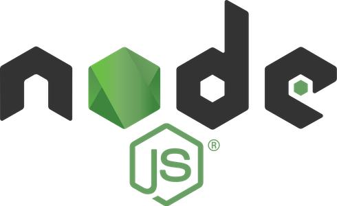

# Leaf Website

This is the repository for the [Leaf website](https://weareleaf.com). Built using [Pug](https://pugjs.org/api/getting-started.html) and [Sass](https://sass-lang.com), in a custom [Webpack](https://webpack.js.org) setup containerised in [Docker](https://www.docker.com) for ease of development.

## Working with the repository

### Initial setup

1. Install [Docker Desktop](https://www.docker.com/products/docker-desktop).
2. Open your terminal, navigate to your project directory in your command line, and run `docker-compose up --build`.

This will build the development environment inside a Docker container, and start a development server viewable at `http://localhost:3000`. Once this is built and running, the server should appear inside the docker application GUI.

While your development server is running, you can change files in `./src` and view the changes in your browser in realtime. However, changing files outside of `./src` or adding new files to `./src` will require you to rebuild your development server. You can do this by stopping your development server, and then running `docker-compose up --build` to start it again, rebuilding it from scratch in the process.

### Available commands

These commands are available from your terminal:

- `docker-compose up`: Start the development server (you can omit the `--build` flag used on initial setup on subsequent runs).
- `docker-compose exec web npm run build:jpgs`: Create jpg copies of all png images on the site with a `#3d18c3` background colour.
- `docker-compose exec web npm run deploy`: Build a production ready version of the site and deploy it to https://weareleaf.com

## Development

### Useful info

- Once started, the development server should be viewable at http://localhost:3000.
- Changes to Pug, JavaScript and SCSS files should automatically reload the page.
- When you add new files, you'll need to restart the development server for them to be picked up.
- If you want to change the background colour of generated jpg images, update the value in `scripts/png-convert.js`.

### Adding blog posts

1.  Copy the existing blog post `src/pages/blog/goals-matter` to a new file. Choose a sensible name with dash-separated words, as this will form the URL of your post.
2.  Start or restart the development server so that it picks up the new file.
3.  View your post at http://localhost:3000/blog/your-post-filename
4.  Edit your blog content by updating your new pug file.
5.  Update the variables at the top of your blog post file, this is important as they're used to display a correct link preview when sharing on social media.
6.  Update the `gridItems` array in `src/assets/scripts/blog.js` to include an entry for your blog post as the the first entry in the array. This will ensure the blog post displays on http://localhost:3000/blog, and is included in the thumbnails at the bottom of each blog post automatically.
7.  Check everything is as you want it, and put your post up for review by submitting a pull request on Github!

Enjoy ❤️
